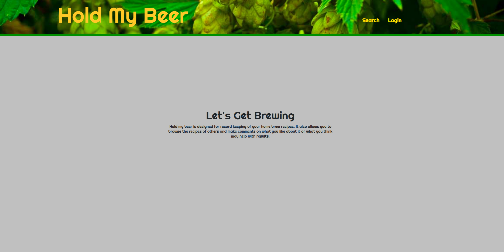
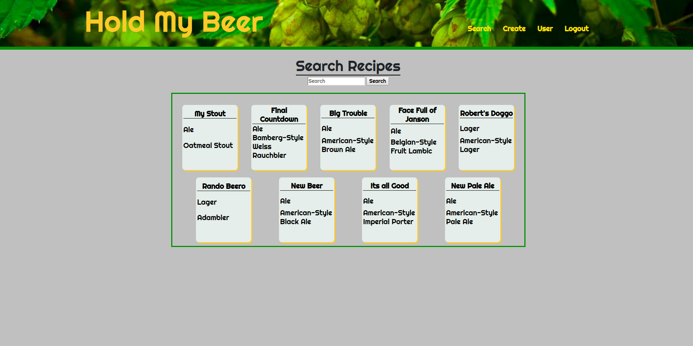
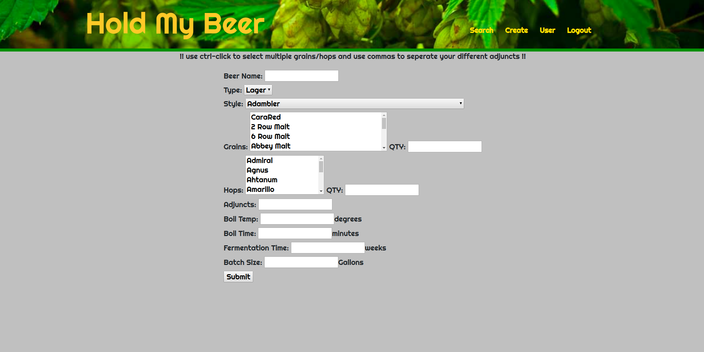
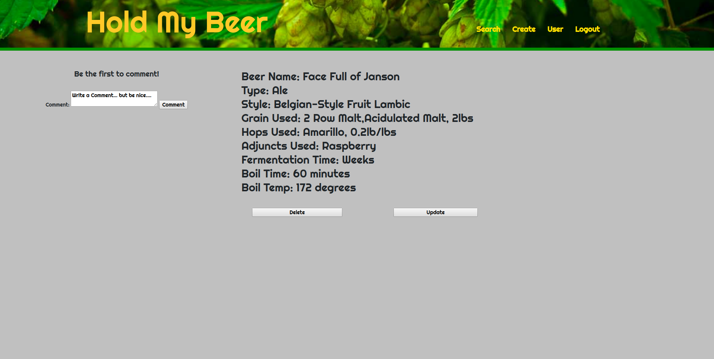
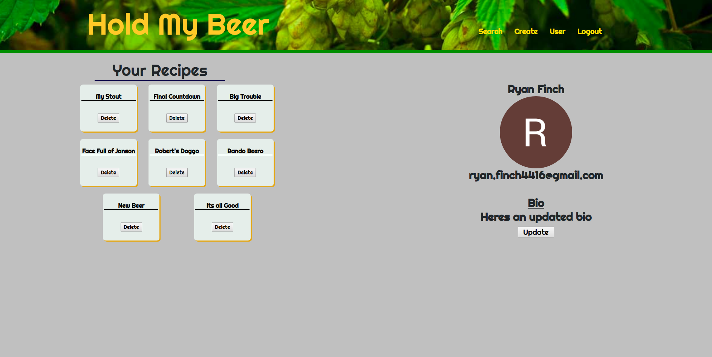

# Hold-My-Beer

Hold-My-Beer is a CRUD app designed to allow users to login and search through recipes shared by others users and themselves. They can also comment on others to give help or ideas on how to improve. Users will also be allowed to delete/edit any recipes they themselves have created.

It is made using, Nodejs, MongoDB, Mongoose, Express, CSS, and some front End Javascript.

Icebox Items
 
-Continue to allow for more advanced inputs for recipes, that would include some math to get back abv% and such.
 
-Create a tutorials section with videos on how to homebrew and tips
 
-Create more of a forum for asking questions and asking for help.

Trello Board 
https://trello.com/b/JoNfurjJ/project-2-hold-my-beer

Screenshots

Home Page

Search Page

Create Page

Recipe Page Wireframe

User Page Wireframe

