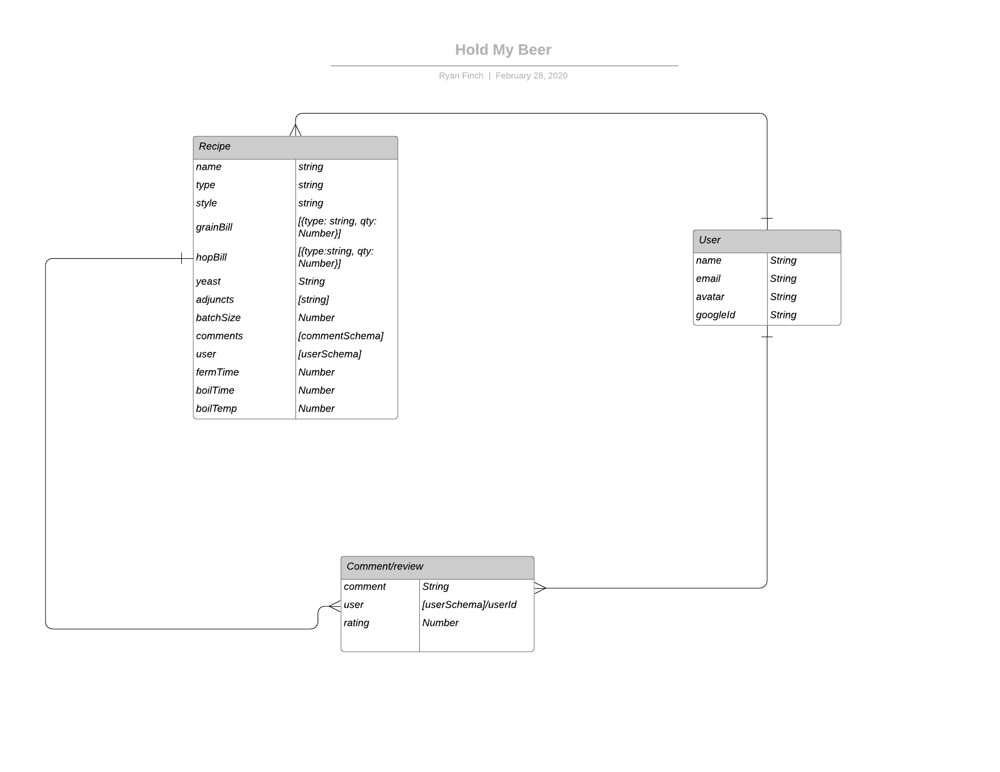
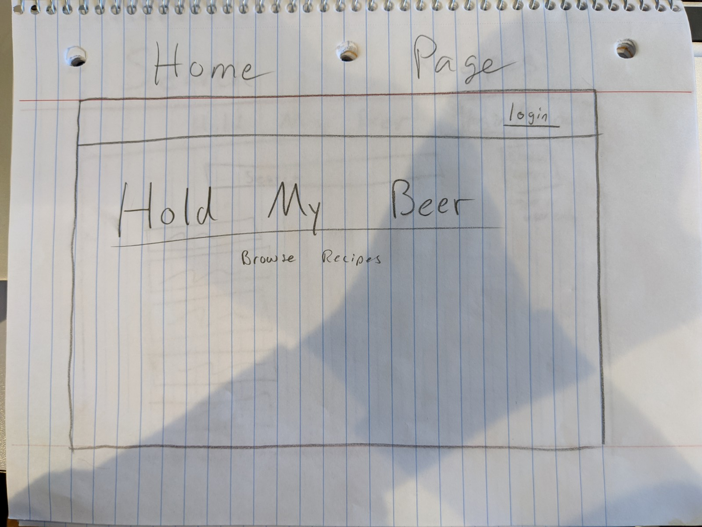
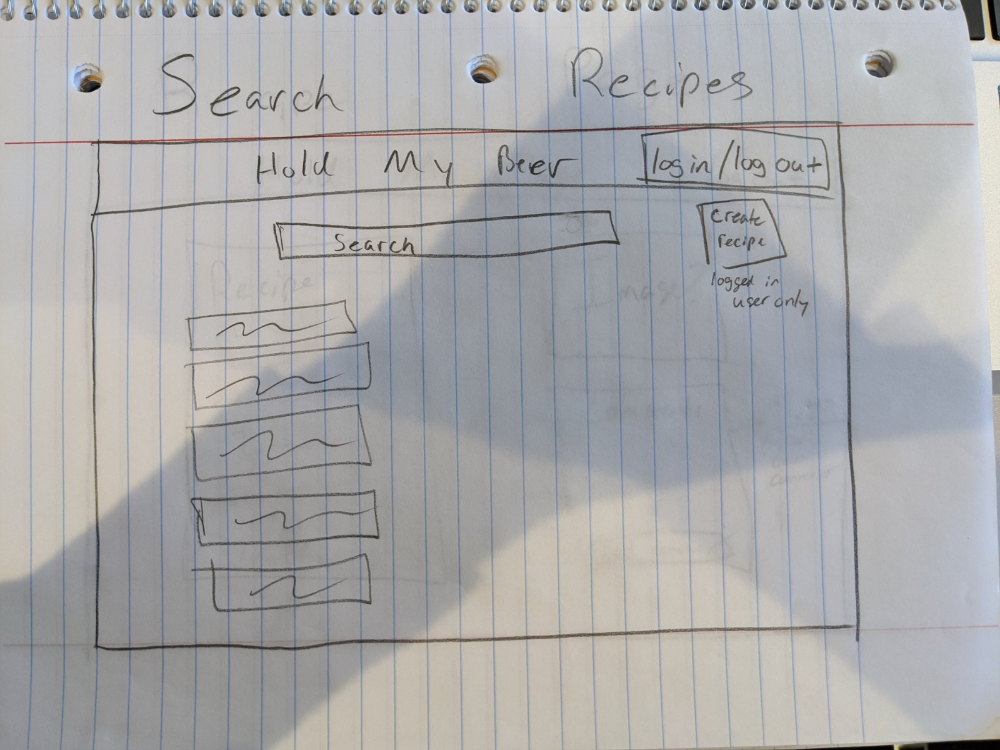
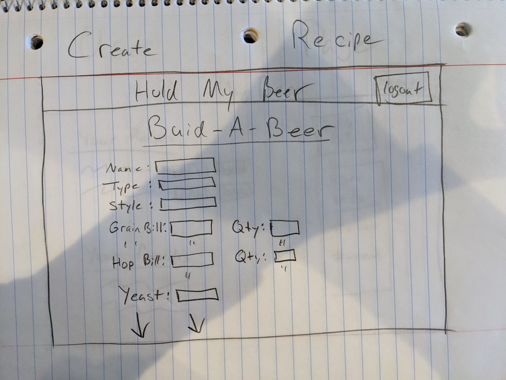
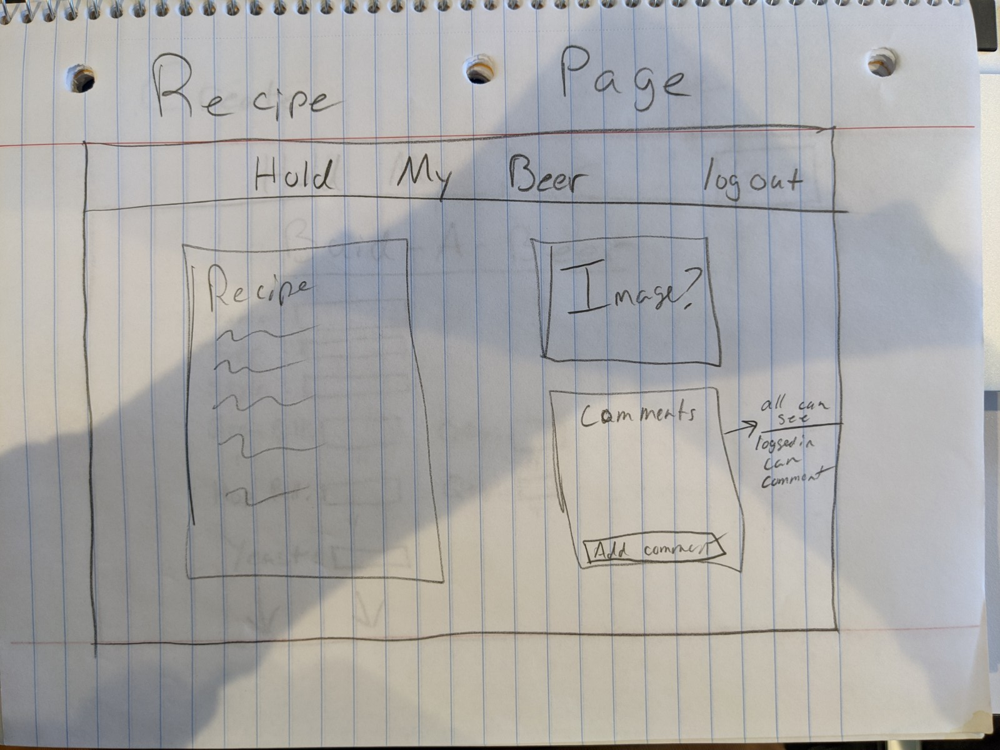
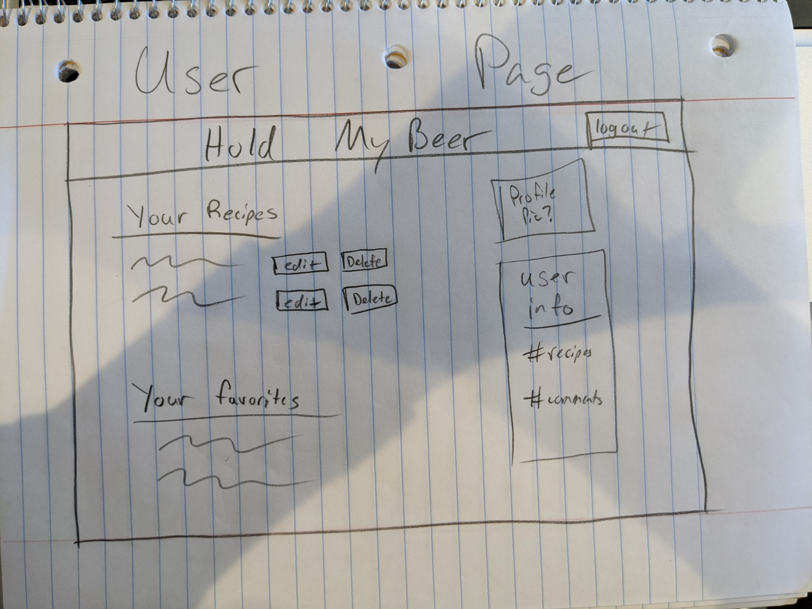

# Hold-My-Beer
Hold-My-Beer is a CRUD app designed to allow users to login and search through recipes shared by others users and themselves. They can also comment on others to give help or ideas on how to improve. Users will also be allowed to delete/edit any recipes they themselves have created.

Trello Board 
https://trello.com/b/JoNfurjJ/project-2-hold-my-beer

ERD

WireFrames

Home Page Wireframe

Search Page Wireframe

Create Page Wireframe

Recipe Page Wireframe

User Page Wireframe

